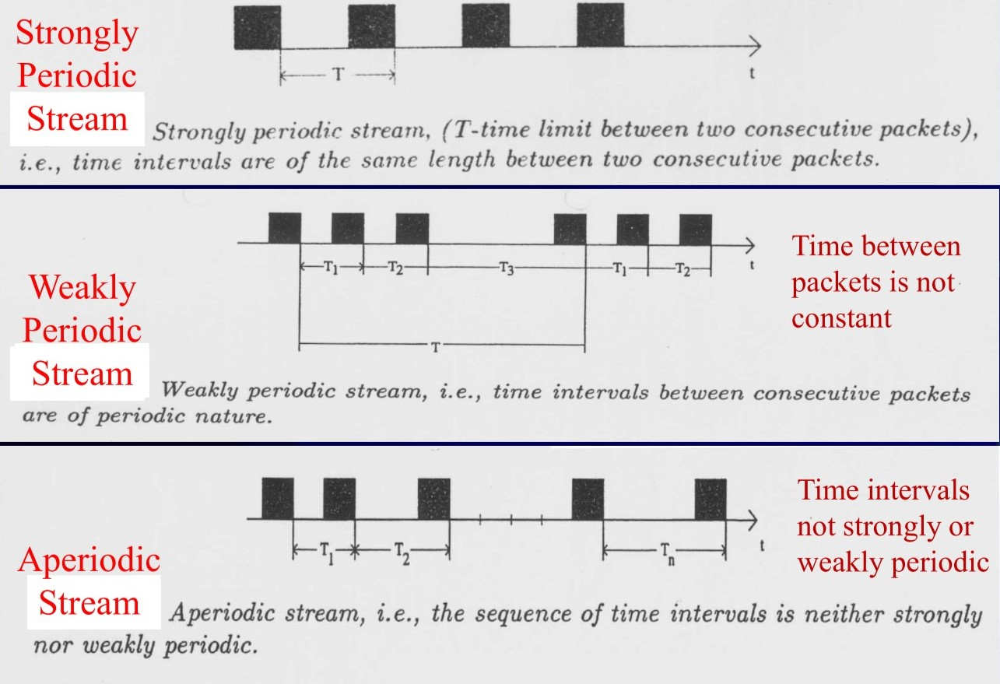

# Lecture 1 : Introduction

---

- [Lecture 1 : Introduction](#lecture-1--introduction)
  - [Multimedia](#multimedia)
  - [Domains of Multimedia](#domains-of-multimedia)
    - [The Media Domain](#the-media-domain)
    - [Digital and Analog Media](#digital-and-analog-media)
    - [Merits of Digital Media (DM)](#merits-of-digital-media-dm)
  - [Media Taxonomy](#media-taxonomy)
  - [Traditional Data Streams Characteristics](#traditional-data-streams-characteristics)
  - [Transmission Modes](#transmission-modes)
    - [Continuous Media: Periodic Stream](#continuous-media-periodic-stream)
    - [Continuous Media: Packet Size](#continuous-media-packet-size)
    - [Sequence of Packets](#sequence-of-packets)
    - [Logical Data Units](#logical-data-units)
  - [Classification of Media Types](#classification-of-media-types)
  - [Media Domain](#media-domain)
    - [Compression](#compression)
  - [Multimedia System](#multimedia-system)
  - [The System Domain](#the-system-domain)
    - [Main properties of MM System:](#main-properties-of-mm-system)
    - [Types of Network Systems:](#types-of-network-systems)

---

## Multimedia

- Multimedia (MM) has pervaded the worlds of entertainment, education and business.
- Computer _information_: represented through _audio_, _video_, _text_, _images_, _graphics_, and _animation_.
- An _interactive computer-mediated_ presentation.
- **Medium**: a _substance_ or an _object_ on which _information_ is stored or transmitted; a _means_ for distribution and presentation of _information_.

---

## Domains of Multimedia
- **Media** domain: "many media types";
- **Systems** domain: "computers";
- **Aplications** domain: "presentation and communication".

---

### The Media Domain
- Media type:
  - _Specification_ or _representation_;
  - _Operations_.
- MM Synchronization
- MM Formation: integrate more media types together.

---

### Digital and Analog Media
- Analog -> digital (coding): _sampling_, _quantization_, _compression_.
- Digital -> analog (decoding).
- Codecs: hardware / software performs coding and decoding, may include _compression_ and _decompression_ algorithms.

---

### Merits of Digital Media (DM)

- Robustness
  - Quality;
  - Stability;
  - Less influenced.
- Seamless Integration
  - Allow integration;
  - Eliminate device dependency;
  - Easy composition;
- Reusability and Interchangeability
  - Reusability;
  - Shareability.
- Distribution Potential

---

## Media Taxonomy
- Perception: perceiving information
- Repressentation: coding information
- Presentation: Input/output media
- Storage: data carrier
- Transmission: network

---

## Traditional Data Streams Characteristics
- Packet (individual unit): from the source to the destination.
- Data Stream (data flow): time-dependent fashion, e.g. telephone system.

## Transmission Modes
- Asynchronous: _packets_
- Synchronous: maximum end-to-end delay for each packet of a _data stream_.
  - Digitally
  - Packet sequence
  - Time dependence

---

### Continuous Media: Periodic Stream
1. Strongly Periodic Stream: between 2 consecutive packets
2. Weakly Periodic Stream: between consecutive packets
3. Aperiodic Stream

---

### Continuous Media: Packet Size
1. Strongly Regular Data
2. Weakly Regular Data
3. Irregular Data Stream

### Sequence of Packets
1. Connected Data Stream
2. Unconnected Data Stream

---

### Logical Data Units
1. Film
2. Clip
3. Frame
4. Block
5. Pixel

---

## Classification of Media Types
- Temporal: 
  - Dynamic, time-based, continuous
  - Audio, video, music, animation
- Non-temporal:
  - Static, non-time-based, discrete
  - Text, graphics, images

---

## Media Domain
1. Text
2. Image
3. Graphic
4. Analog Video
5. Digital Video
6. Digital Audio
7. Music
8. Animation

### Compression
- Eliminate redundancies in the pattern of data
- Reduce the file size for storage.

---

## Multimedia System
- The number of kinds is more important than the number of supported media.
- Most important properties: combination of the media, media independence, computer control and integration

---

## The System Domain

### Main properties of MM System:
1. Media combined.
2. Independence of media.
3. Computer supported integration (timing, spatial and semantic synchronization)
4. Utilization of communication systems

### Types of Network Systems:
1. Standalone system
2. Using dedicated link
3. Using high-speed wide area network