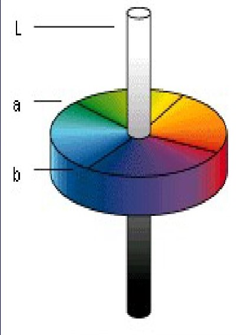
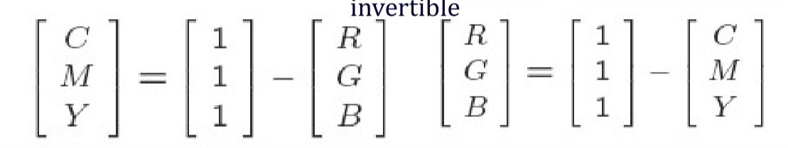

# Lecture 3: Digital Images

- [Lecture 3: Digital Images](#lecture-3-digital-images)
  - [Definitions](#definitions)
  - [Images Format](#images-format)
    - [RGB](#rgb)
    - [Bitmap](#bitmap)
  - [Representation](#representation)
  - [Image Acquisition](#image-acquisition)
  - [Image Representation](#image-representation)
    - [Digital Image Representation](#digital-image-representation)
  - [Image Characteristics](#image-characteristics)
    - [Image Resolution](#image-resolution)
    - [Dynamic range](#dynamic-range)
    - [Image Sampling](#image-sampling)
    - [Image Resolution](#image-resolution-1)
  - [The Image Media Type](#the-image-media-type)
    - [24-Bit Color Image of RGB](#24-bit-color-image-of-rgb)
    - [L*a*b Color Model](#lab-color-model)
    - [YUV Color Model](#yuv-color-model)
    - [YCbCr Color Model](#ycbcr-color-model)
    - [YIQ Color Model](#yiq-color-model)
    - [CMY && CMYK Color Model](#cmy--cmyk-color-model)
    - [Number of Channels](#number-of-channels)
    - [Color Depth](#color-depth)
    - [Pixel Aspect Ratio](#pixel-aspect-ratio)
    - [Compression](#compression)
    - [Basic Operations](#basic-operations)

## Definitions

- _Image_: a **spatial presentation of an object**, a 2-D or 3-D scene or another image.
- An image may be abstractly thought of as a **continuous function** defining a rectangular region of a plane.
- _Image Matrix_: representing **quantized intensity** values.
- _Pixels_: the points at which an image is **sampled**.
- _Intensity_: determined via **sampling** over region of pixel.
- Binary Images: 2 intensity values.
- _Gray Scale_: using luminance information, e.g. 8 bit int 0-255.
- _Color of light_: characterized by the **wavelength** of the light.
- _Visible light_: an electromagnetic wave **400nm ~ 700nm**.
- _Digital Image_: composed of a **collection of pixels**.
- _Resolution_: No. of pixels per a unit or the dots per inch (**dpi**).
- _Sizing_: No. pixels * bits/pixel = No. bits.
- _Image Format_: 
  - Captured image format
  - Stored image format: Bit representation on disk (usually compressed).
- Captured Image Parameters:
  - Spatial resolution: pixels (H * V).
  - Color encoding: bits/pixel.

## Images Format

### RGB

- A type of **computer color display output signal**.
- Consist of separately adjustable red, green, and blue signal or components.

### Bitmap

- A common PC graphics file format.
- Pattern of dots with the extension **.bmp**.

## Representation
    
[Link](#digital-image-representation)

- Color model
- Number of channels
- Color depth
- Storage layout
- Pixel aspect ratio
- Compression

## Image Acquisition

- Intensity: determined via sampling over **region of pixel**.

## Image Representation

### Digital Image Representation

- Optical image: A(x, y) the brightness at position (x, y).

## Image Characteristics

### Image Resolution

- Measure of iamge quality.
- No. of pixels, M * N.

### Dynamic range

- Measure of the range of brightness values
  - 1 bit (binary)
  - 8 bits (grey)
  - 12 bits (medical)
  - 16 bits (Astronomical)
  - 24 bits (color image)
  - Note: n bpp has 2^n gray levels.

### Image Sampling

- Digital: sampled from a **continuous** image.
- _Quantize_ the **intensity values** at the sampled points into **discrete** levels.
- Intensity value: integer.
- No. _intensity values_: **quality** of the stored digital image.

### Image Resolution

- _Accuracy_: affected by the distance between grid points.

## The Image Media Type

- Facsimile (low quality)
  - Over a telephone line.
  - 100 ~ 200 dpi.
- Document (medium quality)
  - Business documents.
  - 300 dpi.
- Photographic (high quality)
  - Requirement: > 300 dpi.

### 24-Bit Color Image of RGB

- Each channel with 8 bits(256).
- _CLT_: **Color Lookup Tables**: use index or code value instead of 24-bit.

### L*a*b Color Model

- L: luminance
- a: red/green balance
- b: yellow/blue balance
- 

### YUV Color Model

- For TV.
- Y: luminance value
- Luma Y': gamma-corrected.
- UV: chrominance
- Reason for gamma-correction: Human's response is **not linear** to the driving **voltage** of display device.
- The difference between a color & a reference white: at the same luminance.
- U = B' - Y'
- V = R' - Y'

### YCbCr Color Model

- Used in MPEG.
- Cb = ((B' - Y')/1.772)+0.5
- Cr = ((R' - Y')/1.402)+0.5

### YIQ Color Model

- Use in **NTSC** (National Television System Committee).
- Y' is the same as in YUV.
- I and Q are rotated version of U and V by **33°**.

### CMY && CMYK Color Model

- CMY: Cyan, Magenta, Yellow.
- **Invertible** transformation from CMY to RGB.
- K: real black: cheaper ink and better than using the mixing colored ink.
- 

### Number of Channels

- The **dimensionality** of the color model.
- From RGB to CMYK:
  1. K = 1 - max(R', G', B')
  2. C = (1 - R' - K) / (1 - K)
  3. M = (1 - G' - K) / (1 - K)
  4. Y = (1 - B' - K) / (1 - K)
   
### Color Depth

- For n bits of information, there are 2^n colors.
- Determined by **video card memory constraints**.

### Pixel Aspect Ratio

- Width / Height.
- Square / Rectangular.

### Compression

- The amount of compression achieved depends on the **image content**.

### Basic Operations

- Editing
- Point operations
- Filtering
- Compositing
- Geometric Transforms
- Conversion
1. Complement Image: O(x, y) = 255 - I(x, y). Image **Enhancement** / **Restoration**.
2. Image Histograms: Distribution of image pixels.
   - The highest peak: background.
   - The second highest peak: foreground.
   - Set a threshold to filter the background.
  

3. Cumulative Histogram: $CH(J) = sum_{j<=J} (N_j)$
