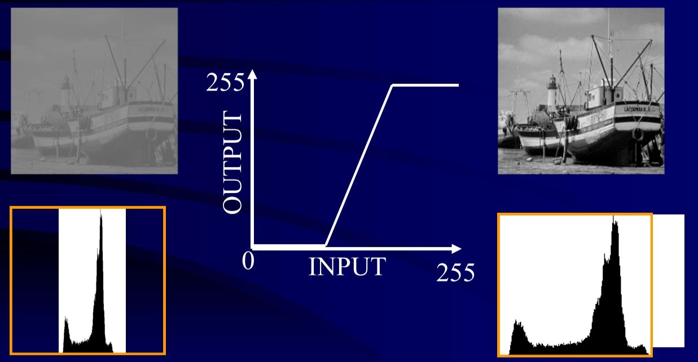
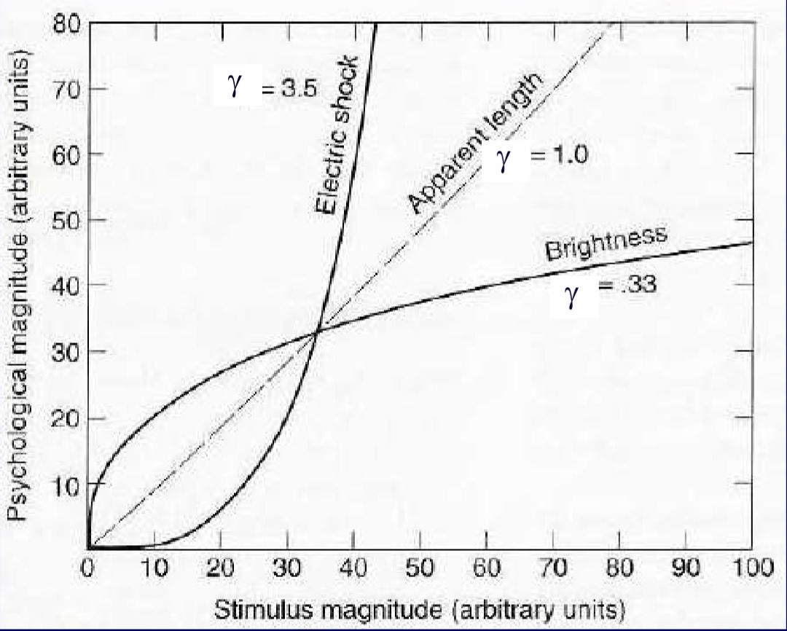
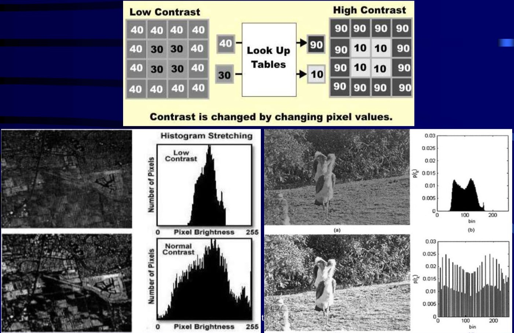
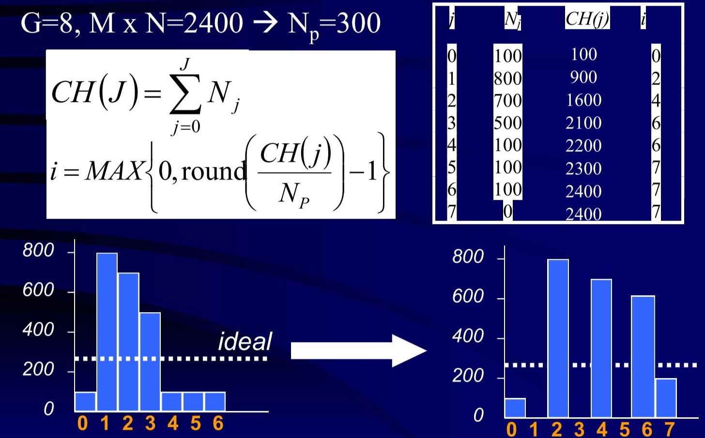

# Lecture 4 : Image & Processing

---

- [Lecture 4 : Image & Processing](#lecture-4--image--processing)
  - [Point Operations](#point-operations)
    - [Contrast Change: Linear Stretching](#contrast-change-linear-stretching)
    - [Contrast Enhancement: Power Law Function](#contrast-enhancement-power-law-function)
    - [Contrast Enhancement: Look up tables (LUT)](#contrast-enhancement-look-up-tables-lut)
    - [Contrast Enhancement: Histogram Equalisation](#contrast-enhancement-histogram-equalisation)
  - [Neighbourhood Operation](#neighbourhood-operation)
    - [Convolution](#convolution)
    - [Noise](#noise)
      - [Noise Reduction: Low Pass Filter (1st principles)](#noise-reduction-low-pass-filter-1st-principles)
      - [Noise Reduction: Low Pass Filter](#noise-reduction-low-pass-filter)
      - [Noise Reduction: Median Filter](#noise-reduction-median-filter)
    - [Filter Operations](#filter-operations)

---

## Point Operations

- A function is applied to **every pixel**: _Transfer function_ $O=T(I)$.
- Operates only on the pixel's **current value**.
  - Thresholding
  - Color correction
  - Change Contrast: through the look up tables

---

### Contrast Change: Linear Stretching

---

### Contrast Enhancement: Power Law Function

$O = I^\gamma$

$\gamma<1$: enhance **contrast** in the **dark** regions.
$\gamma>1$: enhance **contrast** in the **bright** regions. 

---

### Contrast Enhancement: Look up tables (LUT)

---

### Contrast Enhancement: Histogram Equalisation

- Expand Peak
- Squeeze Plain
- Objective: Flat histogram

    $N_P = \frac{M \times N}{G}$ ($M \times N$: no. of all pixels; $G$: no. of gray levels)

    $CH(J) = \sum_{j=0}^J N_j$

    $i = \max{(0, round(\frac{CH(j)}{N_P} - 1))}$ ($CH$: acommulated $N$)

    

---

## Neighbourhood Operation

- Relationships between neighbours determin image features

---

### Convolution

- Mask: every pixel is a weight.
- Weights modify relationships between pixels.
- Convolution size = $(M_1 - M_2 + 1) \times (N_1 - N_2 + 1)$

---

### Noise

Plot: image brightness.

---

#### Noise Reduction: Low Pass Filter (1st principles)

$C_{i+1} = \frac{A_i + A_{i+1} + A_{i+2}}{3}$

#### Noise Reduction: Low Pass Filter

Averaging: Smooth an image

With a convolution: 

E.g.

$$\frac{1}{9}\begin{pmatrix}1&1&1\\
1&1&1\\
1&1&1
\end{pmatrix}$$

Problem: _blurs_ the edge.

---

#### Noise Reduction: Median Filter

$C_i = median{A_{i-1} \times B_1, A_i \times B_2, A_{i+1}\times B_3}$

---
### Filter Operations

1) Low-Pass Filter: smooth an image.
   $\frac{1}{9}\begin{pmatrix}
   1&1&1\\
   1&1&1\\
   1&1&1
   \end{pmatrix}$
   Note: the sum = 1.
   
2) High-Pass Filter: sharpen an image.
   $\begin{pmatrix}
   -1&-1&-1\\
   -1&9&-1\\
   -1&-1&-1
   \end{pmatrix}$

   Note: the sum > 0.

---

3) Sobel Edge Enhancement: Edge extraction (vertical mask & horizontal mask)
   
   $\begin{pmatrix}
   -1&0&1\\
   -2&0&2\\
   -1&0&1
   \end{pmatrix}$

   $\begin{pmatrix}
   -1&-2&-1\\
   0&0&0\\
   1&2&1
   \end{pmatrix}$

   Note: the sum is 0.

4) Laplacian Edge Enhancement: Get all edges.
   
   $\begin{pmatrix}
   -1&-1&-1\\
   -1&8&-1\\
   -1&-1&-1
   \end{pmatrix}$

   Note: the sum is 0.